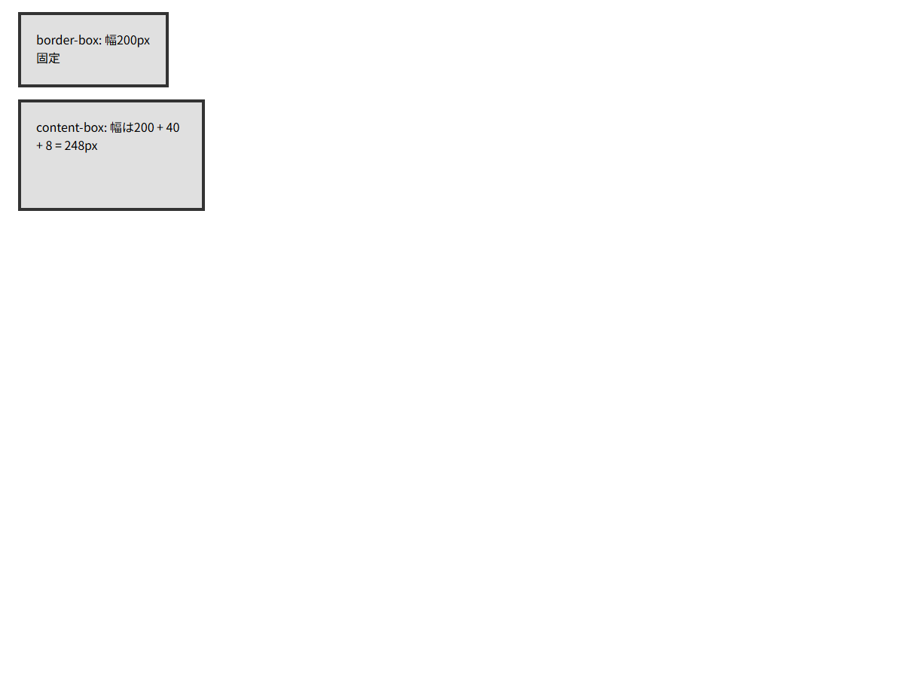

# ボックスモデル

## この教材で身につくこと

- CSSボックスモデルの4層構造を理解する
- `box-sizing` の違いを理解する
- ボックスサイズ計算を正確に行える

## 概要

CSSのすべての要素は矩形のボックスとして扱われます。
ボックスモデルは margin → border → padding → content の4層からなります。
この構造を正確に理解することは、レイアウト設計の土台です。

## 基本文法・プロパティ解説

### ボックスモデル構成図

```
┌─────────────────────────────┐
│           margin            │
│   ┌─────────────────────┐   │
│   │       border        │   │
│   │   ┌─────────────┐   │   │
│   │   │   padding   │   │   │
│   │   │ ┌─────────┐ │   │   │
│   │   │ │ content │ │   │   │
│   │   │ └─────────┘ │   │   │
│   │   └─────────────┘   │   │
│   └─────────────────────┘   │
└─────────────────────────────┘
```

### box-sizing

| 値 | 幅の計算基準 |
|-----|-------------|
| `content-box` (デフォルト) | width = content幅（border/paddingは外側に追加） |
| `border-box` | width = content + padding + border の合計 |

```css
/* 推奨: すべての要素でborder-boxを使用 */
*,
*::before,
*::after {
  box-sizing: border-box;
}
```

### ボックスサイズ計算

```css
/* content-box の場合 */
.box {
  width: 200px;
  padding: 20px;
  border: 5px solid #000;
  /* 実際の幅: 200 + 40 + 10 = 250px */
}

/* border-box の場合 */
.box {
  width: 200px;
  padding: 20px;
  border: 5px solid #000;
  /* 実際の幅: 常に200px */
}
```

### marginの相殺

上下に隣接する要素のmarginは相殺（collapse）されます。

```css
/* 上下マージンは大きい方だけが有効 */
.top { margin-bottom: 20px; }
.bottom { margin-top: 30px; }
/* 間隔 = 30px（20px + 30px ではない） */
```

## 実ソースコード

```html
<!DOCTYPE html>
<html>
<head>
<style>
  * { box-sizing: border-box; }
  .box {
    width: 200px;
    height: 100px;
    padding: 20px;
    border: 4px solid #333;
    margin: 16px;
    background: #e0e0e0;
  }
  .box-content { box-sizing: content-box; }
</style>
</head>
<body>
  <div class="box">border-box: 幅200px固定</div>
  <div class="box box-content">content-box: 幅は200 + 40 + 8 = 248px</div>
</body>
</html>
```

**画面イメージ:**



## レイアウト設計原則との関連

レイアウト設計原則では、ボックスモデルの理解がレイアウト崩れの防止に直結します。

- **min-height: 0** の必要性は、ボックスモデルのデフォルト挙動（min-height: auto）がコンテンツサイズに拡張することに起因します
- 固定値（`100vh`や`calc()`）の問題は、margin/borderを含めた正確なサイズ計算が困難なためです

## 演習課題

1. width: 300px, padding: 15px, border: 2px の要素の実際の幅を content-box / border-box それぞれ計算せよ
2. 2つのdiv（margin-bottom: 25px / margin-top: 35px）を縦に並べたときの間隔を答えよ

## 理解度チェック

- [ ] margin / border / padding / content の内側から外側への順序が言える
- [ ] content-box と border-box の違いを説明できる
- [ ] marginの相殺が発生する条件を説明できる
