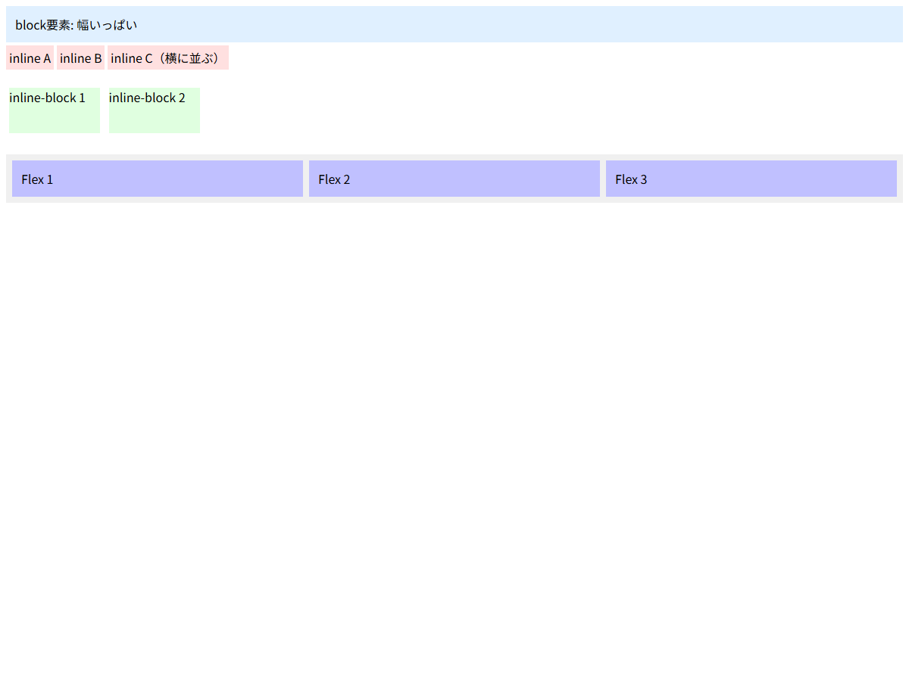

# displayプロパティ

## この教材で身につくこと

- displayプロパティの主要な値とその動作
- block / inline / inline-block の違い
- flex / grid がレイアウトに与える影響
- 要素の表示・非表示の制御

## 概要

`display` プロパティは、要素がドキュメントフローの中でどのように振る舞うかを決定します。
レイアウト設計原則の中心となる flex レイアウトも、この display の理解が前提です。

## 基本文法・プロパティ解説

### レイアウト系のdisplay値

| 値 | 振る舞い | 改行 | width/height |
|-----|---------|------|-------------|
| `block` | 親の幅いっぱいに広がる | ✅ 前後で改行 | ✅ 有効 |
| `inline` | テキストのように流れる | ❌ 改行なし | ❌ 無効 |
| `inline-block` | inlineの流れ + blockのサイズ指定 | ❌ 改行なし | ✅ 有効 |
| `flex` | 子要素をflexアイテム化 | ✅ | ✅ |
| `grid` | 子要素をgridアイテム化 | ✅ | ✅ |
| `none` | 要素を非表示（領域も消える） | - | - |

### display: flex の基本

```css
.container {
  display: flex;
  /* デフォルトでは子要素が横に並ぶ */
}
```

`display: flex` を指定すると、その要素は**flexコンテナ**になり、
直下の子要素は**flexアイテム**になります。
flexコンテナの子要素は、`flex-direction` で定義された
**主轴（main axis）**に沿って配置されます。

### display: none vs visibility: hidden

| プロパティ | 領域 | イベント |
|-----------|------|---------|
| `display: none` | 消える | 受け付けない |
| `visibility: hidden` | 残る | 受け付けない |
| `opacity: 0` | 残る | 受け付ける |

## 実ソースコード

```html
<!DOCTYPE html>
<html>
<head>
<style>
  body { font-family: sans-serif; }
  .block { display: block; background: #e0f0ff; margin: 8px 0; padding: 12px; }
  .inline { display: inline; background: #ffe0e0; padding: 4px; }
  .inline-block { display: inline-block; width: 120px; height: 60px;
                  background: #e0ffe0; margin: 4px; }
  .flex-container {
    display: flex;
    gap: 8px;
    background: #f0f0f0;
    padding: 8px;
  }
  .flex-item {
    flex: 1;
    background: #c0c0ff;
    padding: 12px;
  }
</style>
</head>
<body>
  <div class="block">block要素: 幅いっぱい</div>
  <span class="inline">inline A</span>
  <span class="inline">inline B</span>
  <span class="inline">inline C（横に並ぶ）</span>
  <br><br>
  <div class="inline-block">inline-block 1</div>
  <div class="inline-block">inline-block 2</div>
  <br><br>
  <div class="flex-container">
    <div class="flex-item">Flex 1</div>
    <div class="flex-item">Flex 2</div>
    <div class="flex-item">Flex 3</div>
  </div>
</body>
</html>
```

**画面イメージ:**



## レイアウト設計原則との関連

レイアウト設計原則の核心である**高さ伝播レイヤー**は、
`display: flex` と `flex-direction: column` の組み合わせで実現されています。

```css
/* レイアウト設計原則のレイヤー構造再掲 */
.page {
  display: flex;
  flex-direction: column;
  height: 100%;
}
.top-row {
  flex-shrink: 0;   /* 固定領域 */
}
.content {
  flex: 1;           /* 可変領域：残りの高さをすべて使う */
  min-height: 0;     /* flexデフォルトのautoを上書き */
}
```

## 演習課題

1. `display: inline` と `display: inline-block` の違いを説明せよ
2. `display: flex` を指定した要素の子要素はどう振る舞うか
3. `display: none` と `visibility: hidden` の違いを説明せよ

## 理解度チェック

- [ ] block / inline / inline-block の違いを説明できる
- [ ] display: flex が子要素に与える影響を説明できる
- [ ] display: none を使うとレイアウト上の領域がどうなるか説明できる

---

**前へ:** [03-cascade-and-inheritance.md](03-cascade-and-inheritance.md)  
**次へ:** [05-positioning.md](05-positioning.md)