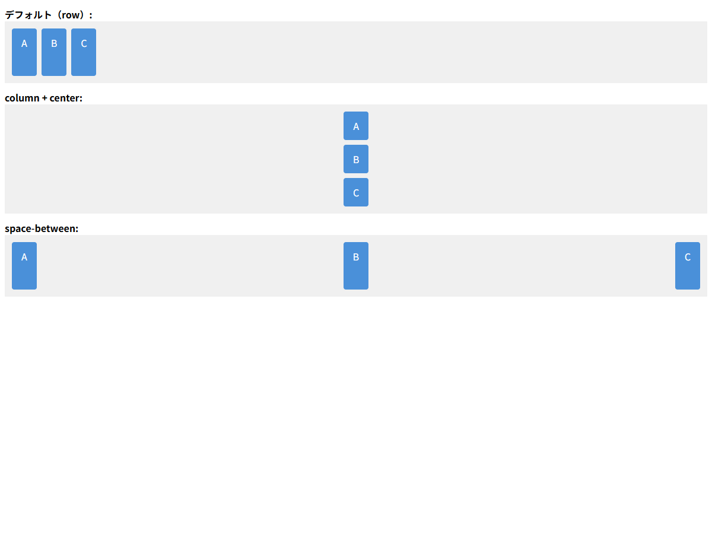

# フレックスコンテナプロパティ

## この教材で身につくこと

- フレックスコンテナを定義するプロパティの全容
- 主軸と交差軸の概念
- アイテムの配置・整列の制御方法
- `gap` による余白管理

## 概要

`display: flex` を指定した要素はフレックスコンテナになります。
コンテナプロパティは、**子要素（flexアイテム）の配置方法**を制御します。

## 基本文法・プロパティ解説

### 主軸と交差軸

```
flex-direction: row の場合

←――――― 主軸（main axis）―――――→
┌──────┐ ┌──────┐ ┌──────┐
│ item │ │ item │ │ item │
└──────┘ └──────┘ └──────┘
          ↓ 交差軸（cross axis）
```

### コンテナプロパティ一覧

| プロパティ | デフォルト | 説明 |
|-----------|-----------|------|
| `display` | - | `flex` / `inline-flex` |
| `flex-direction` | `row` | 主軸方向: row / column / row-reverse / column-reverse |
| `flex-wrap` | `nowrap` | 折り返し: nowrap / wrap / wrap-reverse |
| `justify-content` | `flex-start` | 主軸方向の配置 |
| `align-items` | `stretch` | 交差軸方向の配置 |
| `align-content` | `stretch` | 複数行の交差軸方向配置 |
| `gap` | `0` | アイテム間の間隔 |

### justify-content（主軸配置）

```css
.container {
  display: flex;
  justify-content: center;     /* 中央寄せ */
  justify-content: space-between; /* 両端に配置、等間隔 */
  justify-content: flex-start;    /* 先頭寄せ（デフォルト） */
  justify-content: flex-end;      /* 末尾寄せ */
}
```

### align-items（交差軸配置）

```css
.container {
  display: flex;
  align-items: center;    /* 中央揃え */
  align-items: stretch;   /* 高さ揃え（デフォルト） */
  align-items: flex-start; /* 先頭揃え */
  align-items: flex-end;   /* 末尾揃え */
}
```

## 実ソースコード

```html
<!DOCTYPE html>
<html>
<head>
<style>
  .demo { margin: 12px 0; }
  .container {
    display: flex;
    gap: 8px;
    background: #f0f0f0;
    padding: 12px;
    min-height: 80px;
  }
  .item {
    background: #4a90d9;
    color: #fff;
    padding: 12px 16px;
    border-radius: 4px;
  }
  .column { flex-direction: column; }
  .center { justify-content: center; align-items: center; }
  .between { justify-content: space-between; }
</style>
</head>
<body>
  <div class="demo">
    <strong>デフォルト（row）:</strong>
    <div class="container">
      <div class="item">A</div><div class="item">B</div><div class="item">C</div>
    </div>
  </div>
  <div class="demo">
    <strong>column + center:</strong>
    <div class="container column center">
      <div class="item">A</div><div class="item">B</div><div class="item">C</div>
    </div>
  </div>
  <div class="demo">
    <strong>space-between:</strong>
    <div class="container between">
      <div class="item">A</div><div class="item">B</div><div class="item">C</div>
    </div>
  </div>
</body>
</html>
```

**画面イメージ:**



## レイアウト設計原則との関連

レイアウト設計原則の高さ伝播レイヤーは、
`flex-direction: column` のコンテナを重ねることで実現されています。

```css
/* 縦方向のflexコンテナ */
.page {
  display: flex;
  flex-direction: column;  /* 主軸=縦方向 */
  height: 100%;
}
```

`align-items: stretch`（デフォルト）により、子要素は交差軸方向いっぱいに広がります。
これは幅を明示的に指定しなくてもコンテンツ領域が画面幅を使える理由です。

## 演習課題

1. 3つの要素を横並びにして、両端に寄せるCSSを書け
2. `flex-direction: column` のとき、`justify-content` はどの方向に作用するか
3. `align-items: center` と `justify-content: center` を両方指定したときの見た目を説明せよ

## 理解度チェック

- [ ] 主軸と交差軸の方向を flex-direction との関係で説明できる
- [ ] justify-content と align-items の違いを説明できる
- [ ] gap プロパティの効果を説明できる

---

**前へ:** [00-README.md](00-README.md)  
**次へ:** [02-flex-items.md](02-flex-items.md)