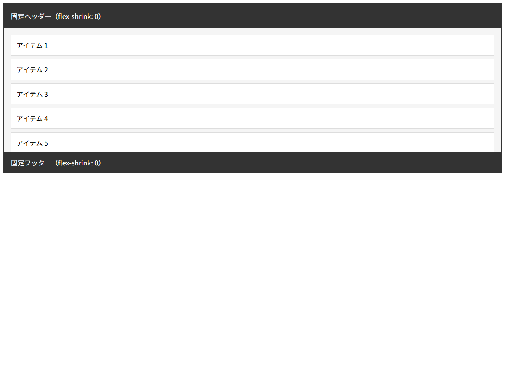

# フレックスアイテムプロパティ

## この教材で身につくこと

- `flex` ショートハンドの3つの値（grow/shrink/basis）の理解
- `flex-shrink: 0` で固定サイズ要素を作る方法
- `min-height: 0` が必須である理由
- `align-self` による個別の交差軸配置

## 概要

フレックスアイテムは、flexコンテナの**直下の子要素**です。
アイテムプロパティは、各アイテムの**伸縮の挙動**を制御します。
レイアウト設計原則の核心ルールはこのアイテムプロパティにあります。

## 基本文法・プロパティ解説

### flex ショートハンド

```css
/* flex: <flex-grow> <flex-shrink> <flex-basis> */
.item {
  flex: 1;        /* flex: 1 1 0%   — 均等に伸縮 */
  flex: 0 0 auto; /* 伸縮しない固定サイズ */
  flex: 1 0 auto; /* 伸びるが縮まない */
}
```

| プロパティ | デフォルト | 説明 |
|-----------|-----------|------|
| `flex-grow` | `0` | 余白の分配比率 |
| `flex-shrink` | `1` | 縮小比率（0で縮まない） |
| `flex-basis` | `auto` | 初期サイズ |

### min-height: 0 — 最重要ルール

```css
/* ❌ 悪い: コンテンツ量に応じて拡張する */
.item {
  flex: 1;
  /* min-height: auto（デフォルト）がコンテンツサイズを保証 */
}

/* ✅ 良い: 親の制約内に収まる */
.item {
  flex: 1;
  min-height: 0; /* デフォルトのautoを上書き */
}
```

**min-height: auto の問題:**
flex子要素のデフォルト `min-height: auto` は、
コンテンツの最小サイズを保証しようとします。
これにより `flex: 1` を指定してもコンテンツ量に応じて拡張し、親を押し広げます。

### flex-shrink: 0

```css
/* 固定高さ要素を縮ませない */
header {
  flex-shrink: 0;
}
```

### align-self

```css
/* 特定のアイテムだけ交差軸の配置を変更 */
.special-item {
  align-self: center;    /* このアイテムだけ中央 */
  align-self: flex-end;  /* このアイテムだけ下 */
}
```

## 実ソースコード

```html
<!DOCTYPE html>
<html>
<head>
<style>
  body { font-family: sans-serif; }

  /* 縦並びflexコンテナ */
  .page {
    display: flex;
    flex-direction: column;
    height: 400px;
    border: 2px solid #333;
  }

  /* 固定ヘッダー */
  .header {
    flex-shrink: 0;
    background: #333;
    color: #fff;
    padding: 16px;
  }

  /* 可変コンテンツ領域 — min-height: 0 が必須 */
  .content {
    flex: 1;
    min-height: 0;
    overflow-y: auto;
    padding: 16px;
    background: #f5f5f5;
  }

  .content-item {
    background: #fff;
    border: 1px solid #ddd;
    padding: 12px;
    margin-bottom: 8px;
  }

  /* 固定フッター */
  .footer {
    flex-shrink: 0;
    background: #333;
    color: #fff;
    padding: 12px 16px;
  }
</style>
</head>
<body>
  <div class="page">
    <div class="header">固定ヘッダー（flex-shrink: 0）</div>
    <div class="content">
      <div class="content-item">アイテム 1</div>
      <div class="content-item">アイテム 2</div>
      <div class="content-item">アイテム 3</div>
      <div class="content-item">アイテム 4</div>
      <div class="content-item">アイテム 5</div>
      <div class="content-item">アイテム 6</div>
      <div class="content-item">アイテム 7</div>
      <div class="content-item">アイテム 8</div>
    </div>
    <div class="footer">固定フッター（flex-shrink: 0）</div>
  </div>
</body>
</html>
```

**画面イメージ:**



## レイアウト設計原則との関連

この教材はレイアウト設計原則の核心ルールをそのまま解説しています。

| 設計原則ルール | 対応プロパティ |
|-----------------|---------------|
| ルール1: flex子要素には `min-height: 0` | `min-height: 0` |
| ルール2: 固定サイズは `flex-shrink: 0` | `flex-shrink: 0` |
| 原則: 伝播はflex | `flex: 1` |

```css
/* レイアウト設計原則のレイヤー構造を実現するアイテムプロパティ */
.page {
  display: flex;
  flex-direction: column;
  height: 100%;
}
.top-row {
  flex-shrink: 0;     /* ← 固定領域 */
}
.content {
  flex: 1;            /* ← 残りの高さをすべて使う */
  min-height: 0;      /* ← 拡張防止 */
  overflow-y: auto;   /* ← スクロール対応 */
}
```

## 演習課題

1. `flex: 1` と `flex: 1 0 auto` の動作の違いを説明せよ
2. `min-height: 0` を設定しないとどうなるか、理由とともに説明せよ
3. ヘッダー（固定）＋本文（可変）＋フッター（固定）の縦3段レイアウトのCSSを書け

## 理解度チェック

- [ ] flex-grow / flex-shrink / flex-basis の役割を説明できる
- [ ] なぜ flex子要素に min-height: 0 が必要か説明できる
- [ ] flex-shrink: 0 を設定するケースを説明できる

---

**前へ:** [01-flex-container.md](01-flex-container.md)  
**次へ:** [03-flexbox-exercises.md](03-flexbox-exercises.md)