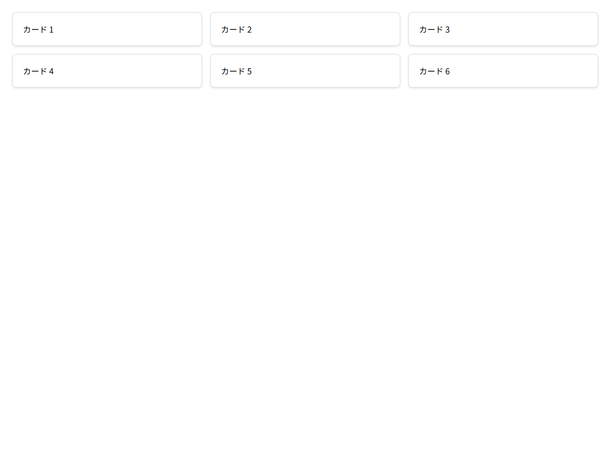
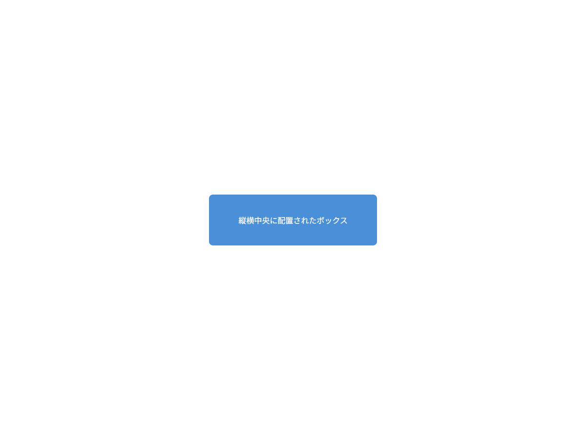

# Flexbox 演習課題

## この教材で身につくこと

- Flexboxを使った実践的なレイアウト構築力
- 複数のflexコンテナを組み合わせた画面設計
- レイアウト設計原則に準拠した縦レイアウト

## 概要

これまで学んだコンテナプロパティとアイテムプロパティを組み合わせて、
実践的なレイアウトを構築する演習です。
各課題には、期待される表示とヒントを用意しています。

## 演習1: ヘッダー＋2カラム＋フッター

以下のレイアウトをFlexboxで実装してください。

```
┌──────────────────────────────┐
│         ヘッダー              │
├──────────────┬───────────────┤
│              │               │
│  サイドバー  │  メイン領域    │
│  (200px固定) │  (残りの幅)   │
│              │               │
├──────────────┴───────────────┤
│         フッター              │
└──────────────────────────────┘
```

### 実ソースコード（解答例）

```html
<!DOCTYPE html>
<html>
<head>
<style>
  * { box-sizing: border-box; margin: 0; padding: 0; }
  body { font-family: sans-serif; }

  .layout {
    display: flex;
    flex-direction: column;
    height: 100vh;
  }

  .header {
    flex-shrink: 0;
    background: #333;
    color: #fff;
    padding: 16px;
  }

  .body {
    display: flex;
    flex: 1;
    min-height: 0;
  }

  .sidebar {
    flex-shrink: 0;
    width: 200px;
    background: #e8e8e8;
    padding: 16px;
    overflow-y: auto;
  }

  .main {
    flex: 1;
    min-width: 0;
    padding: 16px;
    overflow-y: auto;
  }

  .footer {
    flex-shrink: 0;
    background: #333;
    color: #fff;
    padding: 12px 16px;
  }
</style>
</head>
<body>
  <div class="layout">
    <header class="header">ヘッダー</header>
    <div class="body">
      <aside class="sidebar">サイドバー（200px固定）</aside>
      <main class="main">メイン領域（可変）</main>
    </div>
    <footer class="footer">フッター</footer>
  </div>
</body>
</html>
```

**画面イメージ:**


## 演習2: カードリスト（横並び・折り返し）

6枚のカードを3列で表示するレイアウトをFlexboxで実装してください。

### 実ソースコード（解答例）

```html
<!DOCTYPE html>
<html>
<head>
<style>
  * { box-sizing: border-box; }
  body { font-family: sans-serif; }

  .card-list {
    display: flex;
    flex-wrap: wrap;
    gap: 16px;
    padding: 16px;
  }

  .card {
    flex: 0 0 calc(33.333% - 11px); /* 3列: gapを考慮 */
    background: #fff;
    border: 1px solid #ddd;
    border-radius: 8px;
    padding: 20px;
    box-shadow: 0 2px 4px rgba(0,0,0,0.1);
  }
</style>
</head>
<body>
  <div class="card-list">
    <div class="card">カード 1</div>
    <div class="card">カード 2</div>
    <div class="card">カード 3</div>
    <div class="card">カード 4</div>
    <div class="card">カード 5</div>
    <div class="card">カード 6</div>
  </div>
</body>
</html>
```

**画面イメージ:**



## 演習3: 中央配置（縦横中央）

単一の要素を画面の縦横中央に配置するレイアウトをFlexboxで実装してください。

### 実ソースコード（解答例）

```html
<!DOCTYPE html>
<html>
<head>
<style>
  * { box-sizing: border-box; margin: 0; padding: 0; }

  .center-layout {
    display: flex;
    justify-content: center;
    align-items: center;
    height: 100vh;
  }

  .centered-box {
    background: #4a90d9;
    color: #fff;
    padding: 40px 60px;
    border-radius: 8px;
    text-align: center;
  }
</style>
</head>
<body>
  <div class="center-layout">
    <div class="centered-box">縦横中央に配置されたボックス</div>
  </div>
</body>
</html>
```

**画面イメージ:**



## 理解度チェック

- [ ] 縦方向と横方向のflexを組み合わせたレイアウトが組める
- [ ] `flex: 1` と `min-height: 0` を適切に使える
- [ ] `flex-shrink: 0` で固定要素を保護できる
- [ ] ブラウザで実際に表示して崩れがないか確認した
