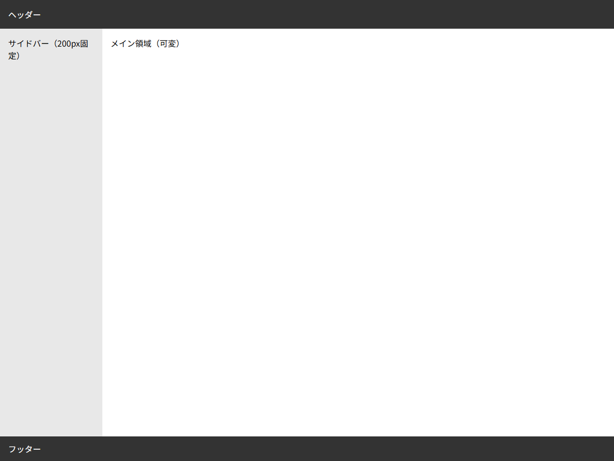

# グリッドコンテナプロパティ

## この教材で身につくこと

- グリッドコンテナを定義するプロパティの全容
- `grid-template-columns` / `grid-template-rows` による行列定義
- `fr` 単位の理解
- `repeat()` / `minmax()` 関数の活用

## 概要

`display: grid` を指定した要素はグリッドコンテナになります。
コンテナプロパティは **行と列の構造** を定義します。

## 基本文法・プロパティ解説

### コンテナプロパティ一覧

| プロパティ | デフォルト | 説明 |
|-----------|-----------|------|
| `display` | - | `grid` / `inline-grid` |
| `grid-template-columns` | `none` | 列の定義 |
| `grid-template-rows` | `none` | 行の定義 |
| `grid-template-areas` | `none` | 名前付きエリア定義 |
| `gap` | `0` | セル間隔（row-gap / column-gap） |
| `justify-items` | `stretch` | セル内の水平配置 |
| `align-items` | `stretch` | セル内の垂直配置 |

### fr単位

`fr`（fraction）は、**利用可能なスペースの比率**を表します。

```css
.grid {
  display: grid;
  grid-template-columns: 1fr 2fr 1fr;
  /* 1 : 2 : 1 の比率 = 25% : 50% : 25% */
}
```

### repeat() と minmax()

```css
.grid {
  display: grid;
  /* 3列を等幅に */
  grid-template-columns: repeat(3, 1fr);

  /* 最小200px、最大は均等 */
  grid-template-columns: repeat(3, minmax(200px, 1fr));
}
```

### grid-template-areas

```css
.layout {
  display: grid;
  grid-template-columns: 200px 1fr;
  grid-template-rows: auto 1fr auto;
  grid-template-areas:
    "header  header"
    "sidebar main"
    "footer  footer";
}
.header  { grid-area: header; }
.sidebar { grid-area: sidebar; }
.main    { grid-area: main; }
.footer  { grid-area: footer; }
```

## 実ソースコード

```html
<!DOCTYPE html>
<html>
<head>
<style>
  * { box-sizing: border-box; margin: 0; padding: 0; }
  body { font-family: sans-serif; }

  .layout {
    display: grid;
    grid-template-columns: 200px 1fr;
    grid-template-rows: auto 1fr auto;
    grid-template-areas:
      "header  header"
      "sidebar main"
      "footer  footer";
    height: 100vh;
    gap: 0;
  }

  .header {
    grid-area: header;
    background: #333;
    color: #fff;
    padding: 16px;
  }

  .sidebar {
    grid-area: sidebar;
    background: #e8e8e8;
    padding: 16px;
    overflow-y: auto;
  }

  .main {
    grid-area: main;
    padding: 16px;
    overflow-y: auto;
    min-height: 0;
  }

  .footer {
    grid-area: footer;
    background: #333;
    color: #fff;
    padding: 12px 16px;
  }
</style>
</head>
<body>
  <div class="layout">
    <header class="header">ヘッダー</header>
    <aside class="sidebar">サイドバー（200px固定）</aside>
    <main class="main">メイン領域（可変）</main>
    <footer class="footer">フッター</footer>
  </div>
</body>
</html>
```

**画面イメージ:**



## レイアウト設計原則との関連

レイアウト設計原則のレイヤー構成図では、下位レイヤーで `display: grid` が使用されています。

```css
/* レイアウト設計原則のレイヤー構成図より */
section {
  height: 100%;
  display: grid;
  min-height: 0;
}
```

Gridは**flexの代替ではなく補完**です。
レイアウト設計原則では、高さ伝播はflex、パネル分割はgridという使い分けをしています。

## 演習課題

1. 3列のグリッドを作り、中央列だけ2倍の幅にするCSSを書け
2. `fr` と `%` の違いを説明せよ
3. grid-template-areas を使ったレイアウトの利点を説明せよ

## 理解度チェック

- [ ] grid-template-columns で行と列を定義できる
- [ ] fr単位の意味と計算方法を説明できる
- [ ] repeat() と minmax() の使い方を説明できる
- [ ] grid-template-areas でエリア配置ができる

---

**前へ:** [00-README.md](00-README.md)  
**次へ:** [02-grid-items.md](02-grid-items.md)