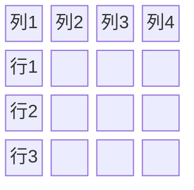
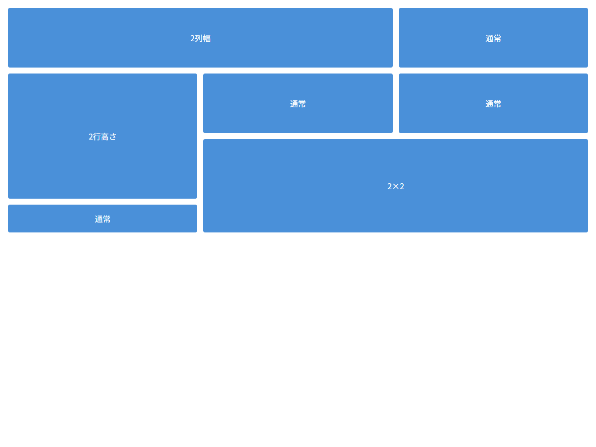

# グリッドアイテムプロパティ

## この教材で身につくこと

- グリッドアイテムの配置を制御するプロパティ
- `grid-column` / `grid-row` によるセル結合
- `min-height: 0` のGridにおける必要性
- Flexboxアイテムとの類似点・相違点

## 概要

グリッドアイテムは、gridコンテナの**直下の子要素**です。
アイテムプロパティは、各アイテムが**どのセルを占有するか**を制御します。

## 基本文法・プロパティ解説

### アイテムプロパティ一覧

| プロパティ | デフォルト | 説明 |
|-----------|-----------|------|
| `grid-column` | `auto` | 列の占有範囲（start / end） |
| `grid-row` | `auto` | 行の占有範囲（start / end） |
| `grid-area` | `auto` | 名前付きエリアへの配置 |
| `justify-self` | `stretch` | セル内の水平配置 |
| `align-self` | `stretch` | セル内の垂直配置 |

### grid-column / grid-row

```css
/* 2列分を占有 */
.item { grid-column: span 2; }

/* 1行目の1列目から3列目まで */
.item { grid-column: 1 / 3; }

/* 2行分を占有 */
.item { grid-row: span 2; }
```

### ライン番号による配置



```css
/* ライン1〜3（2セル分の幅） */
.item {
  grid-column: 1 / 3;
  grid-row: 1 / 2;
}
```

### min-height: 0（Gridでも必須）

```css
/* Gridでもflexと同様、min-height: 0 が必要 */
.grid-item {
  display: flex;
  flex-direction: column;
  min-height: 0;  /* コンテンツ溢れを抑制 */
  overflow-y: auto;
}
```

## 実ソースコード

```html
<!DOCTYPE html>
<html>
<head>
<style>
  * { box-sizing: border-box; }
  body { font-family: sans-serif; margin: 16px; }

  .grid {
    display: grid;
    grid-template-columns: repeat(3, 1fr);
    grid-template-rows: repeat(3, 120px);
    gap: 12px;
  }

  .item {
    background: #4a90d9;
    color: #fff;
    padding: 16px;
    border-radius: 4px;
    display: flex;
    align-items: center;
    justify-content: center;
  }

  /* 2列分の幅 */
  .wide { grid-column: span 2; }

  /* 2行分の高さ */
  .tall { grid-row: span 2; }

  /* 2列 × 2行 */
  .big {
    grid-column: span 2;
    grid-row: span 2;
  }
</style>
</head>
<body>
  <div class="grid">
    <div class="item wide">2列幅</div>
    <div class="item">通常</div>
    <div class="item tall">2行高さ</div>
    <div class="item">通常</div>
    <div class="item">通常</div>
    <div class="item big">2×2</div>
    <div class="item">通常</div>
  </div>
</body>
</html>
```

**画面イメージ:**



## レイアウト設計原則との関連

レイアウト設計原則のレイヤー構成図におけるGridの使用例：

```css
/* レイアウト設計原則より: grid内でflexをネスト */
section {
  height: 100%;
  display: grid;
  min-height: 0;
}
.panel {
  overflow: hidden;
  display: flex;
  flex-direction: column;
  min-height: 0;
}
.messages {
  flex: 1;
  min-height: 0;
  overflow-y: auto;
}
```

ポイント：
- Gridでパネルを2次元配置
- 各パネル内はflexで縦方向の高さ伝播
- `min-height: 0` と `overflow` の適切な設定

## 演習課題

1. 4列グリッドで、1つ目のアイテムだけ2列分占有するCSSを書け
2. `grid-column: 1 / 3` と `grid-column: span 2` の違いを説明せよ
3. Grid内でflexを使う場合になぜ `min-height: 0` が必要か説明せよ

## 理解度チェック

- [ ] grid-column / grid-row でセル結合ができる
- [ ] ライン番号とspanの使い分けを説明できる
- [ ] Grid内のflexで min-height: 0 がなぜ必要か説明できる

---

**前へ:** [01-grid-container.md](01-grid-container.md)  
**次へ:** [03-grid-exercises.md](03-grid-exercises.md)