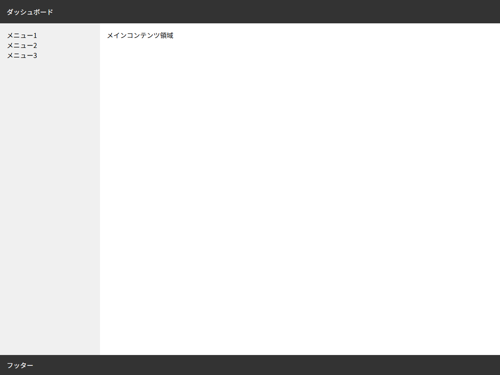
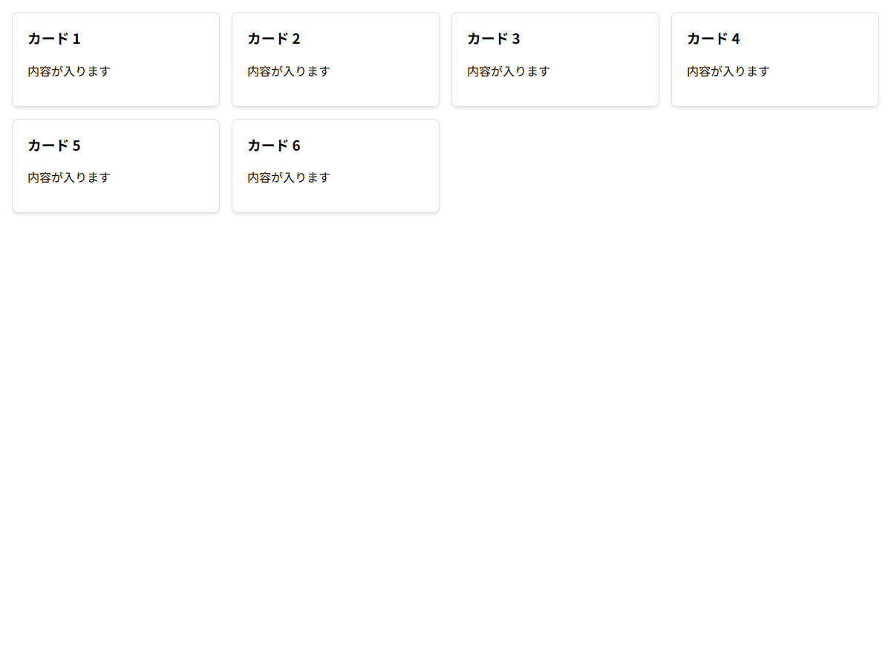
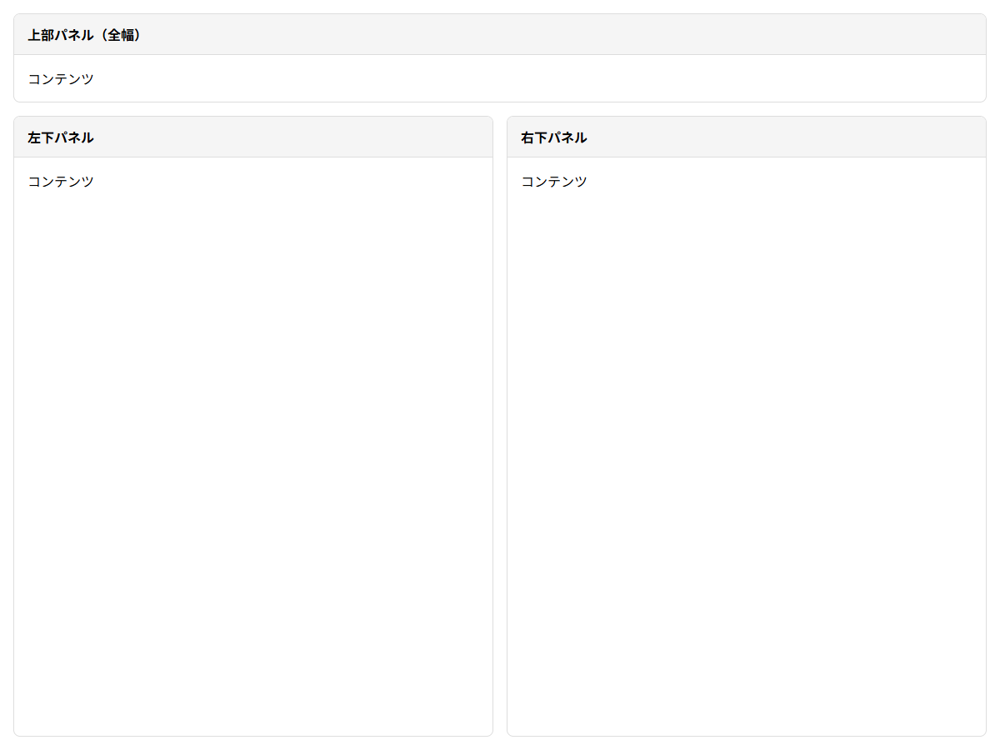

# CSS Grid 演習課題

## この教材で身につくこと

- CSS Gridを使った実践的なレイアウト構築力
- GridとFlexboxの組み合わせによる複合レイアウト
- レスポンシブグリッドの基本

## 演習1: ダッシュボードグリッド

ヘッダー・サイドバー・メイン・フッターの4エリアをGridで実装してください。

### 実ソースコード（解答例）

```html
<!DOCTYPE html>
<html>
<head>
<style>
  * { box-sizing: border-box; margin: 0; padding: 0; }
  body { font-family: sans-serif; }

  .dashboard {
    display: grid;
    grid-template-columns: 240px 1fr;
    grid-template-rows: auto 1fr auto;
    grid-template-areas:
      "header  header"
      "sidebar main"
      "footer  footer";
    height: 100vh;
  }

  .header  { grid-area: header; background: #333; color: #fff; padding: 16px; }
  .sidebar { grid-area: sidebar; background: #f0f0f0; padding: 16px; overflow-y: auto; }
  .main    { grid-area: main; padding: 16px; overflow-y: auto; min-height: 0; }
  .footer  { grid-area: footer; background: #333; color: #fff; padding: 12px 16px; }
</style>
</head>
<body>
  <div class="dashboard">
    <header class="header">ダッシュボード</header>
    <aside class="sidebar">
      <p>メニュー1</p><p>メニュー2</p><p>メニュー3</p>
    </aside>
    <main class="main">メインコンテンツ領域</main>
    <footer class="footer">フッター</footer>
  </div>
</body>
</html>
```

**画面イメージ:**



## 演習2: レスポンシブカードグリッド

画面幅に応じてカラム数が変わるカードグリッドを実装してください。

### 実ソースコード（解答例）

```html
<!DOCTYPE html>
<html>
<head>
<style>
  * { box-sizing: border-box; }
  body { font-family: sans-serif; margin: 16px; }

  .card-grid {
    display: grid;
    grid-template-columns: repeat(auto-fill, minmax(280px, 1fr));
    gap: 16px;
  }

  .card {
    background: #fff;
    border: 1px solid #ddd;
    border-radius: 8px;
    padding: 20px;
    box-shadow: 0 2px 4px rgba(0,0,0,0.1);
  }

  .card h3 { margin-top: 0; }
</style>
</head>
<body>
  <div class="card-grid">
    <div class="card"><h3>カード 1</h3><p>内容が入ります</p></div>
    <div class="card"><h3>カード 2</h3><p>内容が入ります</p></div>
    <div class="card"><h3>カード 3</h3><p>内容が入ります</p></div>
    <div class="card"><h3>カード 4</h3><p>内容が入ります</p></div>
    <div class="card"><h3>カード 5</h3><p>内容が入ります</p></div>
    <div class="card"><h3>カード 6</h3><p>内容が入ります</p></div>
  </div>
</body>
</html>
```

**画面イメージ:**



## 演習3: Grid + Flex 複合レイアウト

Gridで全体の枠組みを作り、各エリア内はFlexboxで配置してください。

### 実ソースコード（解答例）

```html
<!DOCTYPE html>
<html>
<head>
<style>
  * { box-sizing: border-box; margin: 0; padding: 0; }
  body { font-family: sans-serif; }

  .layout {
    display: grid;
    grid-template-columns: 1fr 1fr;
    grid-template-rows: auto 1fr;
    gap: 16px;
    height: 100vh;
    padding: 16px;
  }

  .top-full { grid-column: 1 / -1; }

  .panel {
    display: flex;
    flex-direction: column;
    min-height: 0;
    border: 1px solid #ddd;
    border-radius: 8px;
    overflow: hidden;
  }

  .panel-header {
    flex-shrink: 0;
    background: #f5f5f5;
    padding: 12px 16px;
    font-weight: bold;
    border-bottom: 1px solid #ddd;
  }

  .panel-body {
    flex: 1;
    min-height: 0;
    overflow-y: auto;
    padding: 16px;
  }
</style>
</head>
<body>
  <div class="layout">
    <div class="top-full panel">
      <div class="panel-header">上部パネル（全幅）</div>
      <div class="panel-body">コンテンツ</div>
    </div>
    <div class="panel">
      <div class="panel-header">左下パネル</div>
      <div class="panel-body">コンテンツ</div>
    </div>
    <div class="panel">
      <div class="panel-header">右下パネル</div>
      <div class="panel-body">コンテンツ</div>
    </div>
  </div>
</body>
</html>
```

**画面イメージ:**



## 理解度チェック

- [ ] grid-template-areas でエリア配置ができる
- [ ] auto-fill + minmax でレスポンシブグリッドが作れる
- [ ] GridとFlexboxを組み合わせたレイアウトが組める
- [ ] Grid内でも overflow と min-height: 0 を適切に設定できる

---

**前へ:** [02-grid-items.md](02-grid-items.md)  
**次へ:** [../04-layout-patterns/00-README.md](../04-layout-patterns/00-README.md)