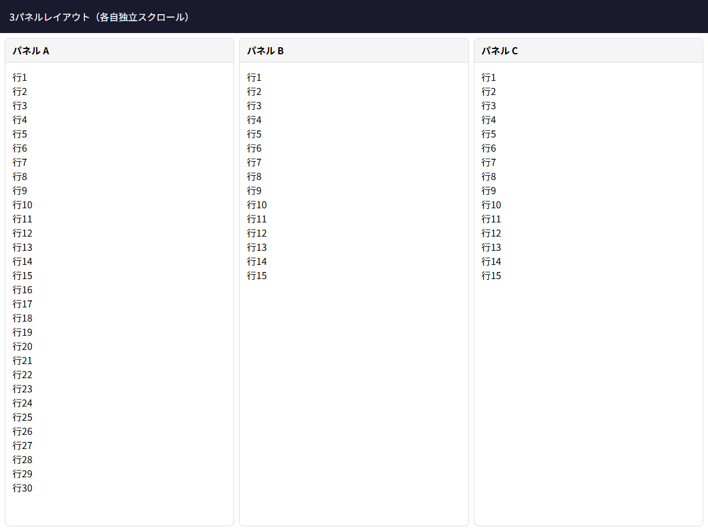

# スクロール戦略

## この教材で身につくこと

- 適切なスクロール境界の設計方法
- `overflow` プロパティのレイヤー別設定ルール
- `overflow: hidden` の正しい使いどころ
- 複数パネルでのスクロール設計

## 概要

レイアウト設計原則 第3原則「スクロール戦略」の実践教材です。
overflow の配置を誤ると、コンテンツが見切れたり、画面全体がスクロール不能になります。
正しいレイヤー設計でこれを防ぎます。

## 基本方針

| レイヤー | overflow設定 | 目的 |
|----------|-------------|------|
| html/body/#root | 設定しない | ブラウザデフォルトに任せる |
| ページコンテナ (main) | `overflow: auto` | 全体が溢れた場合の最終境界 |
| パネルラッパー | `overflow: hidden` | 内部でのみスクロールさせる境界 |
| コンテンツ領域 | `overflow-y: auto` | 実際のスクロール発生箇所 |

## レイヤー別解説

### html/body/#root: overflow設定しない

```css
/* ✅ 良い: ブラウザ任せ */
html, body, #root {
  height: 100%;
  /* overflow は指定しない */
}

/* ❌ 悪い: 上位層でoverflow:hidden */
html, body, #root {
  height: 100%;
  overflow: hidden; /* 下位の全コンテンツが隠れる */
}
```

### ページコンテナ: overflow: auto

```css
.main {
  flex: 1;
  min-height: 0;
  overflow: auto; /* 最終的なスクロール境界 */
}
```

### パネルラッパー: overflow: hidden

```css
.panel-wrapper {
  overflow: hidden; /* 内部スクロールの境界を明示 */
}
```

`overflow: hidden` はコンテンツを隠すのではなく、
**「この要素の内部でのみスクロールする」** という境界を宣言するものです。

### コンテンツ領域: overflow-y: auto

```css
.content {
  flex: 1;
  min-height: 0;
  overflow-y: auto; /* 実際にスクロールバーが表示される */
}
```

## 実ソースコード: 3パネル分割のスクロール戦略

```html
<!DOCTYPE html>
<html>
<head>
<style>
  * { box-sizing: border-box; margin: 0; padding: 0; }
  html, body, #root { height: 100%; }
  body { font-family: sans-serif; }

  .app {
    display: flex;
    flex-direction: column;
    height: 100%;
  }

  .app-header {
    flex-shrink: 0;
    background: #1a1a2e;
    color: #fff;
    padding: 16px;
  }

  /* main = スクロール境界 */
  .app-main {
    flex: 1;
    min-height: 0;
    overflow: auto;
  }

  /* Gridで3パネル */
  .panels {
    height: 100%;
    display: grid;
    grid-template-columns: 1fr 1fr 1fr;
    gap: 8px;
    padding: 8px;
  }

  .panel {
    overflow: hidden; /* スクロール境界 */
    display: flex;
    flex-direction: column;
    min-height: 0;
    border: 1px solid #ddd;
    border-radius: 8px;
  }

  .panel-header {
    flex-shrink: 0;
    background: #f5f5f5;
    padding: 8px 12px;
    font-weight: bold;
    border-bottom: 1px solid #ddd;
  }

  .panel-content {
    flex: 1;
    min-height: 0;
    overflow-y: auto; /* 実際のスクロール */
    padding: 12px;
  }
</style>
</head>
<body>
  <div id="root">
    <div class="app">
      <header class="app-header">3パネルレイアウト（各自独立スクロール）</header>
      <main class="app-main">
        <div class="panels">
          <div class="panel">
            <div class="panel-header">パネル A</div>
            <div class="panel-content">
              <p>行1</p><p>行2</p><!-- 30行まで増やせる -->
            </div>
          </div>
          <div class="panel">
            <div class="panel-header">パネル B</div>
            <div class="panel-content">
              <p>行1</p><p>行2</p>
            </div>
          </div>
          <div class="panel">
            <div class="panel-header">パネル C</div>
            <div class="panel-content">
              <p>行1</p><p>行2</p>
            </div>
          </div>
        </div>
      </main>
    </div>
  </div>
</body>
</html>
```

**画面イメージ:**



## アンチパターン

```css
/* ❌ アンチパターン: 上位で overflow:hidden */
html, body, #root {
  height: 100%;
  overflow: hidden;  /* 画面下部が完全に隠れる */
}

/* ❌ アンチパターン: スクロールすべき場所に overflow なし */
.content {
  flex: 1;
  min-height: 0;
  /* overflow-y: auto がない → コンテンツがはみ出る */
}
```

## 演習課題

1. 2パネルレイアウトで、左パネルと右パネルが独立してスクロールするCSSを書け
2. `overflow: hidden` を設定すべきレイヤーと設定してはいけないレイヤーを説明せよ
3. `overflow: auto` と `overflow-y: auto` の使い分けを説明せよ

## 理解度チェック

- [ ] overflowのレイヤー別設定ルールを説明できる
- [ ] overflow: hidden の正しい使いどころを説明できる
- [ ] 複数パネルが独立してスクロールするレイアウトを組める
- [ ] 上位層にoverflow:hiddenを設定した場合の弊害を説明できる
