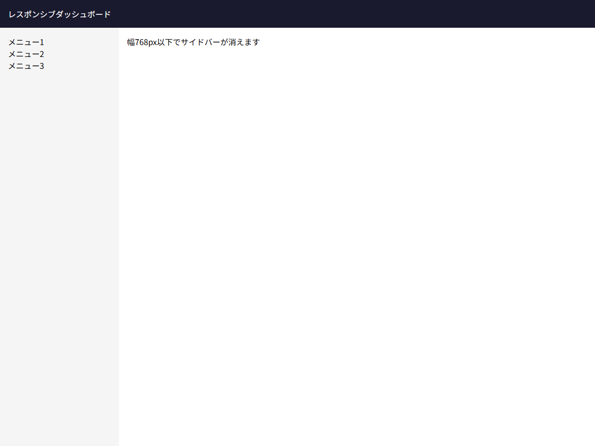

# レスポンシブ対応

## この教材で身につくこと

- メディアクエリを使ったブレークポイント設計
- 画面幅に応じたレイアウト切り替え
- レイアウト設計原則に準拠したレスポンシブ設計
- 可変レイアウトと固定値の適切な使い分け

## 概要

レイアウト設計原則が想定する主な適用先はデスクトップのSPAですが、
基本的なレスポンシブ対応を組み込むことで、タブレットやノートPCなど
異なる画面サイズでも安定したレイアウトを提供できます。

## 基本文法・プロパティ解説

### メディアクエリ基本構文

```css
/* 画面幅が768px以下の場合 */
@media (max-width: 768px) {
  .sidebar { display: none; }
}

/* 画面幅が1024px以上の場合 */
@media (min-width: 1024px) {
  .container { max-width: 1200px; }
}
```

### ブレークポイント設計

| ブレークポイント | 対象 | レイアウト変更 |
|----------------|------|---------------|
| 〜600px | スマホ | 1カラム |
| 600〜900px | タブレット | 2カラム |
| 900〜1200px | 小型ノートPC | サイドバー表示 |
| 1200px〜 | デスクトップ | フルレイアウト |

### 原則準拠のレスポンシブ

レイアウト設計原則はレスポンシブでも有効です。
特に重要なのは「固定値はルートのみ」という原則です。

```css
/* ✅ 原則準拠: flexによる可変レイアウト */
.layout {
  display: flex;
  height: 100%;
}

/* ❌ 非推奨: メディアクエリで固定値を切り替え */
@media (max-width: 768px) {
  .main { height: calc(100vh - 60px); }  /* 禁止 */
}
```

## 実ソースコード: レスポンシブダッシュボード

```html
<!DOCTYPE html>
<html>
<head>
<style>
  * { box-sizing: border-box; margin: 0; padding: 0; }
  html, body, #root { height: 100%; }
  body { font-family: sans-serif; }

  .app {
    display: flex;
    flex-direction: column;
    height: 100%;
  }

  .header {
    flex-shrink: 0;
    background: #1a1a2e;
    color: #fff;
    padding: 16px;
  }

  .body {
    display: flex;
    flex: 1;
    min-height: 0;
  }

  .sidebar {
    flex-shrink: 0;
    width: 240px;
    background: #f5f5f5;
    padding: 16px;
    overflow-y: auto;
  }

  .main {
    flex: 1;
    min-width: 0;
    padding: 16px;
    overflow-y: auto;
  }

  /* タブレット以下: サイドバーを非表示 */
  @media (max-width: 768px) {
    .sidebar {
      display: none;
    }
  }
</style>
</head>
<body>
  <div id="root">
    <div class="app">
      <header class="header">レスポンシブダッシュボード</header>
      <div class="body">
        <aside class="sidebar">
          <p>メニュー1</p><p>メニュー2</p><p>メニュー3</p>
        </aside>
        <main class="main">
          <p>幅768px以下でサイドバーが消えます</p>
        </main>
      </div>
    </div>
  </div>
</body>
</html>
```

**画面イメージ:**



## レイアウト設計原則との統合

```css
/* 完全なレイアウト設計原則 + レスポンシブ対応 */
html, body, #root { height: 100%; }

.app {
  display: flex;
  flex-direction: column;
  height: 100%;
}

.main {
  flex: 1;
  min-height: 0;
  overflow: auto;
}

.page {
  height: 100%;
  display: flex;
  flex-direction: column;
  min-height: 0;
}

/* レスポンシブ: 横並び→縦積み */
@media (max-width: 768px) {
  .row-layout {
    flex-direction: column;
  }
}
```

## ウィンドウ高さの確認

レイアウト設計原則のチェックリスト項目「ウィンドウ高さ 600px/768px/900px/1080px で確認」を実践します。

```css
/* ブラウザ開発者ツールで以下のサイズに切り替えて確認 */
/* 600px: 最低限の表示確認 */
/* 768px: タブレット横 */
/* 900px: 小型ノートPC */
/* 1080px: フルHD */
```

## 演習課題

1. 768px以下で2カラム→1カラムに変わるレイアウトをGridで実装せよ
2. レイアウト設計原則の「固定値はルートのみ」を守りながらレスポンシブ対応する方法を説明せよ
3. モバイルで `100vh` が正しく機能しない理由を説明せよ

## 理解度チェック

- [ ] メディアクエリでブレークポイントを設定できる
- [ ] レスポンシブ時もレイアウト設計原則を守れる
- [ ] 600px/768px/900px/1080px の各高さで動作確認できる
