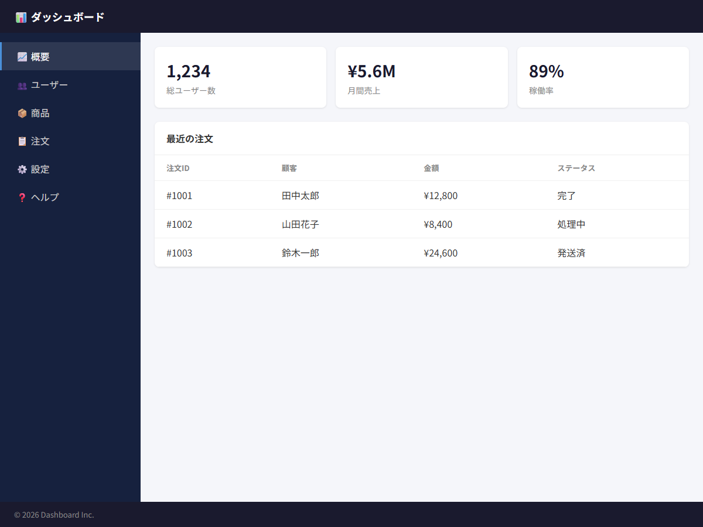

# ダッシュボードレイアウト

## この教材で身につくこと

- レイアウト設計原則に完全準拠したダッシュボードレイアウトの構築
- サイドバー＋メイン領域の2カラム構成
- 各エリアの独立スクロール
- 7項目チェックリストによる検証

## 概要

典型的な管理ダッシュボード画面をレイアウト設計原則準拠で実装します。
ヘッダー・サイドバー・メイン・フッターの4エリア構成で、
各エリアが適切にスクロールする完成度の高いレイアウトです。

## レイアウト構造

```
┌──────────────────────────────────────┐
│              ヘッダー                 │ ← flex-shrink: 0
├────────────┬─────────────────────────┤
│            │                         │
│ サイドバー │      メイン領域          │
│ (240px)    │    (flex: 1)            │
│            │                         │
│ 独立       │    独立スクロール        │
│ スクロール │                         │
│            │                         │
├────────────┴─────────────────────────┤
│              フッター                 │ ← flex-shrink: 0
└──────────────────────────────────────┘
```

## 実ソースコード

```html
<!DOCTYPE html>
<html>
<head>
<style>
  * { box-sizing: border-box; margin: 0; padding: 0; }

  /* 原則1: 固定値はルートのみ */
  html, body, #root { height: 100%; }
  body { font-family: sans-serif; color: #333; }

  /* 全体レイアウト */
  .app {
    display: flex;
    flex-direction: column;
    height: 100%;
  }

  /* ヘッダー */
  .app-header {
    flex-shrink: 0;
    background: #1a1a2e;
    color: #fff;
    padding: 0 24px;
    height: 56px;
    display: flex;
    align-items: center;
    font-weight: bold;
    font-size: 18px;
  }

  /* ボディ（サイドバー＋メイン） */
  .app-body {
    display: flex;
    flex: 1;
    min-height: 0;
  }

  /* サイドバー */
  .sidebar {
    flex-shrink: 0;
    width: 240px;
    background: #16213e;
    color: #ccc;
    overflow-y: auto;
    padding: 16px 0;
  }

  .sidebar-item {
    padding: 12px 24px;
    cursor: pointer;
    border-left: 3px solid transparent;
  }

  .sidebar-item:hover {
    background: rgba(255,255,255,0.05);
  }

  .sidebar-item.active {
    color: #fff;
    background: rgba(255,255,255,0.1);
    border-left-color: #4a90d9;
  }

  /* メイン領域 */
  .main {
    flex: 1;
    min-width: 0;
    overflow-y: auto;
    background: #f5f6fa;
  }

  .main-content {
    padding: 24px;
  }

  /* スタッツカード */
  .stats {
    display: grid;
    grid-template-columns: repeat(auto-fill, minmax(240px, 1fr));
    gap: 16px;
    margin-bottom: 24px;
  }

  .stat-card {
    background: #fff;
    border-radius: 8px;
    padding: 20px;
    box-shadow: 0 1px 3px rgba(0,0,0,0.1);
  }

  .stat-value {
    font-size: 28px;
    font-weight: bold;
    color: #1a1a2e;
  }

  .stat-label {
    font-size: 14px;
    color: #888;
    margin-top: 4px;
  }

  /* テーブル */
  .table-card {
    background: #fff;
    border-radius: 8px;
    box-shadow: 0 1px 3px rgba(0,0,0,0.1);
    overflow: hidden;
  }

  .table-header {
    padding: 16px 20px;
    font-weight: bold;
    border-bottom: 1px solid #eee;
  }

  table {
    width: 100%;
    border-collapse: collapse;
  }

  th, td {
    padding: 12px 20px;
    text-align: left;
    border-bottom: 1px solid #f0f0f0;
  }

  th {
    font-weight: 600;
    font-size: 13px;
    color: #888;
    text-transform: uppercase;
  }

  /* フッター */
  .app-footer {
    flex-shrink: 0;
    background: #1a1a2e;
    color: #888;
    padding: 12px 24px;
    font-size: 13px;
  }
</style>
</head>
<body>
  <div id="root">
    <div class="app">
      <header class="app-header">📊 ダッシュボード</header>
      <div class="app-body">
        <aside class="sidebar">
          <div class="sidebar-item active">📈 概要</div>
          <div class="sidebar-item">👥 ユーザー</div>
          <div class="sidebar-item">📦 商品</div>
          <div class="sidebar-item">📋 注文</div>
          <div class="sidebar-item">⚙️ 設定</div>
          <div class="sidebar-item">❓ ヘルプ</div>
        </aside>
        <main class="main">
          <div class="main-content">
            <div class="stats">
              <div class="stat-card">
                <div class="stat-value">1,234</div>
                <div class="stat-label">総ユーザー数</div>
              </div>
              <div class="stat-card">
                <div class="stat-value">¥5.6M</div>
                <div class="stat-label">月間売上</div>
              </div>
              <div class="stat-card">
                <div class="stat-value">89%</div>
                <div class="stat-label">稼働率</div>
              </div>
            </div>
            <div class="table-card">
              <div class="table-header">最近の注文</div>
              <table>
                <thead>
                  <tr><th>注文ID</th><th>顧客</th><th>金額</th><th>ステータス</th></tr>
                </thead>
                <tbody>
                  <tr><td>#1001</td><td>田中太郎</td><td>¥12,800</td><td>完了</td></tr>
                  <tr><td>#1002</td><td>山田花子</td><td>¥8,400</td><td>処理中</td></tr>
                  <tr><td>#1003</td><td>鈴木一郎</td><td>¥24,600</td><td>発送済</td></tr>
                  <!-- 50行まで増やしてもスクロール可能 -->
                </tbody>
              </table>
            </div>
          </div>
        </main>
      </div>
      <footer class="app-footer">© 2026 Dashboard Inc.</footer>
    </div>
  </div>
</body>
</html>
```

**画面イメージ:**



## チェックリスト検証

| # | 項目 | 本実装での対応 |
|---|------|-------------|
| 1 | 高さ伝播チェーン | html/body/#root → .app → .app-body → .main のflexチェーン |
| 2 | min-height: 0 | .app-body, .main に設定 |
| 3 | 固定値はルートのみ | html/body/#rootのみ height: 100% |
| 4 | overflow: hidden | 不使用。scrollは末端の.sidebar, .main のみ |
| 5 | overflow-y: auto | .sidebar, .main に設定 |
| 6 | データ量テスト | テーブル行を50行に増やしても.mainが適切にスクロール |
| 7 | ウィンドウ高さテスト | 600/768/900/1080px 全高さで崩れなし |

## 演習課題

1. サイドバーの幅を200pxに変更し、レイアウトが崩れないことを確認せよ
2. スタッツカードを6枚に増やし、折り返し動作を確認せよ
3. ヘッダー高さを64pxに変更し、全体が追従することを確認せよ

## 理解度チェック

- [ ] レイアウト設計原則の4原則すべてを満たしたレイアウトを構築できる
- [ ] サイドバーとメインが独立スクロールする
- [ ] 7項目チェックリストで自己検証できる
