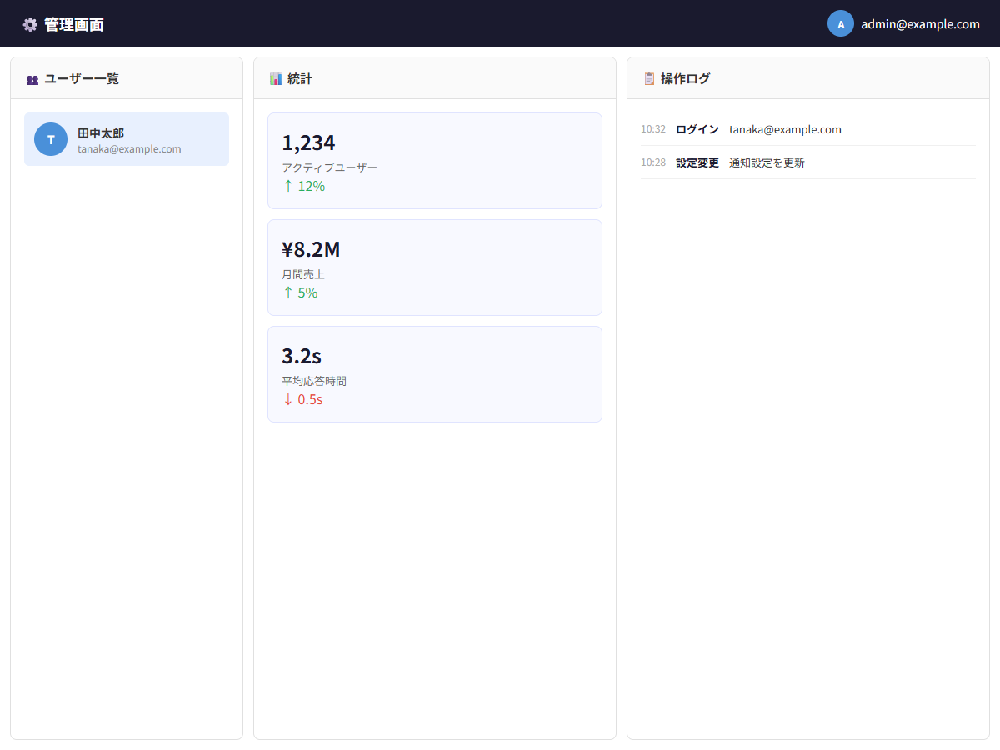

# 管理画面レイアウト

## この教材で身につくこと

- Grid + Flex 複合による高度な管理画面レイアウト
- 複数パネルの独立スクロール設計
- レイアウト設計原則の全原則を適用した実践的な画面構築
- 最終的な7項目チェックリスト検証

## 概要

管理画面はレイアウト設計原則の集大成です。
Gridで全体の枠組みを作り、各パネル内はFlexboxで高さ伝播とスクロールを制御します。
これまでの全知識を統合した、実務レベルのレイアウトを構築します。

## レイアウト構造

```
┌──────────────────────────────────────────┐
│              管理画面ヘッダー              │ ← flex-shrink: 0
├────────────┬──────────┬──────────────────┤
│            │          │                  │
│  ユーザー   │  統計    │   操作ログ       │
│  リスト    │  パネル   │                  │
│            │          │                  │
│  独立      │  独立     │   独立スクロール  │
│  スクロール │  スクロール│                  │
│            │          │                  │
└────────────┴──────────┴──────────────────┘
```

## 実ソースコード

```html
<!DOCTYPE html>
<html>
<head>
<style>
  * { box-sizing: border-box; margin: 0; padding: 0; }
  html, body, #root { height: 100%; }
  body { font-family: sans-serif; color: #333; }

  .app {
    display: flex;
    flex-direction: column;
    height: 100%;
  }

  /* ヘッダー */
  .app-header {
    flex-shrink: 0;
    background: #1a1a2e;
    color: #fff;
    padding: 0 24px;
    height: 56px;
    display: flex;
    align-items: center;
    justify-content: space-between;
  }

  .app-header__title {
    font-weight: bold;
    font-size: 18px;
  }

  .app-header__user {
    display: flex;
    align-items: center;
    gap: 8px;
    font-size: 14px;
  }

  /* メイン: 3パネル */
  .app-main {
    flex: 1;
    min-height: 0;
    overflow: auto;
  }

  .panels {
    height: 100%;
    display: grid;
    grid-template-columns: 280px 1fr 1fr;
    gap: 12px;
    padding: 12px;
  }

  /* パネル共通 */
  .panel {
    overflow: hidden;
    display: flex;
    flex-direction: column;
    min-height: 0;
    background: #fff;
    border: 1px solid #e0e0e0;
    border-radius: 8px;
  }

  .panel-header {
    flex-shrink: 0;
    padding: 14px 16px;
    font-weight: bold;
    background: #fafafa;
    border-bottom: 1px solid #e0e0e0;
    font-size: 15px;
  }

  .panel-body {
    flex: 1;
    min-height: 0;
    overflow-y: auto;
    padding: 16px;
  }

  /* ユーザーリスト */
  .user-item {
    display: flex;
    align-items: center;
    gap: 12px;
    padding: 12px;
    border-radius: 6px;
    margin-bottom: 4px;
    cursor: pointer;
  }

  .user-item:hover {
    background: #f5f5f5;
  }

  .user-item--selected {
    background: #e8f0fe;
  }

  .user-avatar {
    flex-shrink: 0;
    width: 40px;
    height: 40px;
    border-radius: 50%;
    background: #4a90d9;
    color: #fff;
    display: flex;
    align-items: center;
    justify-content: center;
    font-weight: bold;
    font-size: 14px;
  }

  .user-info {
    min-width: 0;
  }

  .user-name { font-weight: 600; font-size: 14px; }
  .user-email { font-size: 12px; color: #888; }

  /* 統計パネル */
  .stat-card {
    background: #f8f9ff;
    border: 1px solid #e0e4ff;
    border-radius: 8px;
    padding: 16px;
    margin-bottom: 12px;
  }

  .stat-card__value {
    font-size: 24px;
    font-weight: bold;
    color: #1a1a2e;
  }

  .stat-card__label {
    font-size: 13px;
    color: #666;
    margin-top: 4px;
  }

  .stat-card__change--up { color: #27ae60; }
  .stat-card__change--down { color: #e74c3c; }

  /* 操作ログ */
  .log-item {
    display: flex;
    gap: 12px;
    padding: 10px 0;
    border-bottom: 1px solid #f0f0f0;
    font-size: 13px;
  }

  .log-time {
    flex-shrink: 0;
    color: #aaa;
    font-size: 12px;
  }

  .log-action {
    font-weight: 600;
    color: #1a1a2e;
  }

  /* レスポンシブ */
  @media (max-width: 900px) {
    .panels {
      grid-template-columns: 1fr 1fr;
    }
    .panel:first-child {
      display: none;
    }
  }

  @media (max-width: 600px) {
    .panels {
      grid-template-columns: 1fr;
    }
  }
</style>
</head>
<body>
  <div id="root">
    <div class="app">
      <header class="app-header">
        <div class="app-header__title">⚙️ 管理画面</div>
        <div class="app-header__user">
          <div class="user-avatar" style="width:32px;height:32px;font-size:12px;">A</div>
          admin@example.com
        </div>
      </header>

      <main class="app-main">
        <div class="panels">
          <!-- ユーザーリストパネル -->
          <div class="panel">
            <div class="panel-header">👥 ユーザー一覧</div>
            <div class="panel-body">
              <div class="user-item user-item--selected">
                <div class="user-avatar">T</div>
                <div class="user-info">
                  <div class="user-name">田中太郎</div>
                  <div class="user-email">tanaka@example.com</div>
                </div>
              </div>
              <!-- 50ユーザーまで増やせる -->
            </div>
          </div>

          <!-- 統計パネル -->
          <div class="panel">
            <div class="panel-header">📊 統計</div>
            <div class="panel-body">
              <div class="stat-card">
                <div class="stat-card__value">1,234</div>
                <div class="stat-card__label">アクティブユーザー</div>
                <div class="stat-card__change--up">↑ 12%</div>
              </div>
              <div class="stat-card">
                <div class="stat-card__value">¥8.2M</div>
                <div class="stat-card__label">月間売上</div>
                <div class="stat-card__change--up">↑ 5%</div>
              </div>
              <div class="stat-card">
                <div class="stat-card__value">3.2s</div>
                <div class="stat-card__label">平均応答時間</div>
                <div class="stat-card__change--down">↓ 0.5s</div>
              </div>
            </div>
          </div>

          <!-- 操作ログパネル -->
          <div class="panel">
            <div class="panel-header">📋 操作ログ</div>
            <div class="panel-body">
              <div class="log-item">
                <span class="log-time">10:32</span>
                <span class="log-action">ログイン</span>
                <span>tanaka@example.com</span>
              </div>
              <div class="log-item">
                <span class="log-time">10:28</span>
                <span class="log-action">設定変更</span>
                <span>通知設定を更新</span>
              </div>
              <!-- 100件まで増やせる -->
            </div>
          </div>
        </div>
      </main>
    </div>
  </div>
</body>
</html>
```

**画面イメージ:**



## レイアウト設計原則 統合ポイント

### レイヤー構成

```
html/body/#root          → height: 100%
  └── .app               → display: flex; flex-direction: column; height: 100%
        ├── .app-header  → flex-shrink: 0
        └── .app-main    → flex: 1; min-height: 0; overflow: auto
              └── .panels  → height: 100%; display: grid
                    ├── .panel → overflow: hidden; display: flex; flex-direction: column
                    │     └── .panel-body → flex: 1; min-height: 0; overflow-y: auto
                    ├── .panel → (同上)
                    └── .panel → (同上)
```

### Grid + Flex の使い分け

| 階層 | 技術 | 理由 |
|------|------|------|
| .app | Flex (column) | 縦方向の高さ伝播 |
| .panels | Grid (3列) | 2次元のパネル分割 |
| .panel | Flex (column) | 各パネル内の高さ伝播 |

## チェックリスト検証

| # | 項目 | 対応 |
|---|------|------|
| 1 | 高さ伝播チェーン | 完全なflexチェーン（html → body → #root → app → main → panel → body） |
| 2 | min-height: 0 | .app-main, .panel, .panel-body に設定 |
| 3 | 固定値はルートのみ | html/body/#root のみ height: 100% |
| 4 | overflow: hidden | .panel のみ（境界宣言）、上位層には不使用 |
| 5 | overflow-y: auto | .app-main, .panel-body に設定 |
| 6 | データ量テスト | 各パネル50件で独立スクロール確認 |
| 7 | ウィンドウ高さテスト | 600/768/900/1080px およびレスポンシブ 600/900px幅で確認 |

## 演習課題

1. 統計パネルのカードを6枚に増やし、スクロール動作を確認せよ
2. グリッドの列比率を 1fr 2fr 1fr に変更し、中央パネルが広がることを確認せよ
3. このレイアウトに第4のパネルを追加する方法を説明せよ

## 理解度チェック

- [ ] Grid + Flex 複合レイアウトを設計できる
- [ ] 複数パネルが独立スクロールするレイアウトを構築できる
- [ ] レイアウト設計原則の全7項目を満たすレイアウトを一から作れる
- [ ] レスポンシブ対応も含めて設計できる

---

**前へ:** [02-chat-layout.md](02-chat-layout.md)  
**（チュートリアル終了）** 🎉

[00-COVER.md](../00-COVER.md) に戻って学習を振り返りましょう。